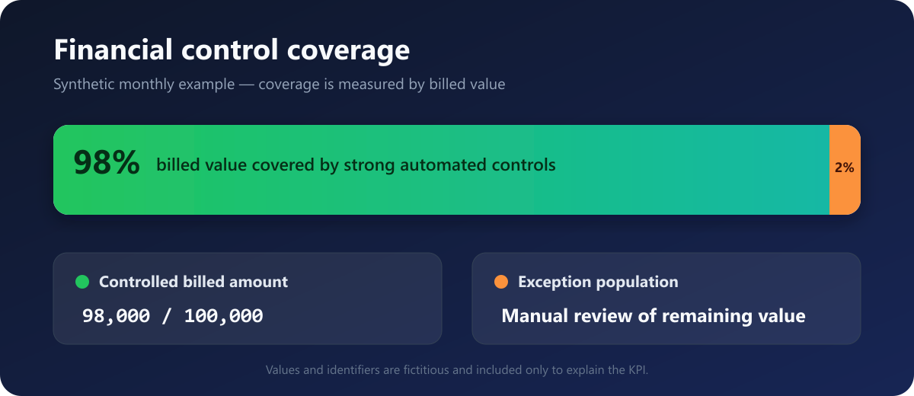
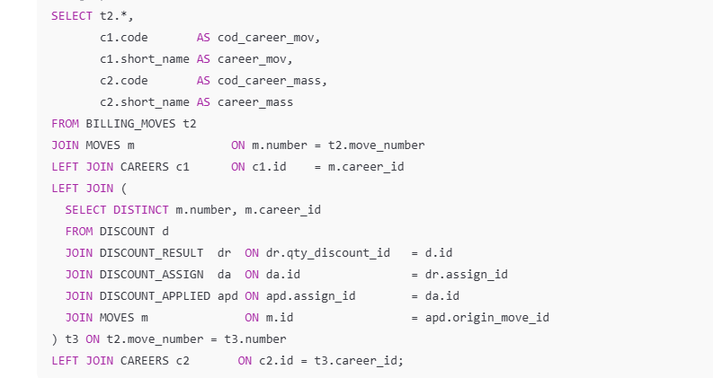
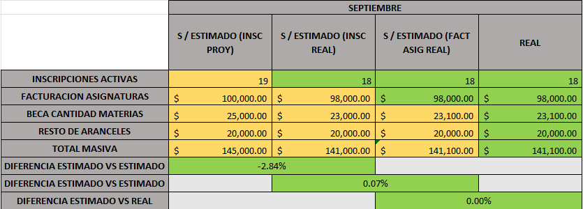

# Financial Controls: From ACL and Oracle SQL to Python/Jupyter

[English](README.md) | [Español](README.es.md)

A professional data-control case study based on automated billing reconciliation work. The original solution combines Oracle SQL, ACL Analytics, and Excel; its current evolution migrates selected controls to **Python, Jupyter Notebook, and Pandas**, while retaining Oracle as the source and making validations, justifications, and exceptions explicit.

All public code, data, identifiers, and screenshots are synthetic or sanitized. Production scripts, connection details, student information, and internal database objects are intentionally excluded.

> **Current work status:** the ACL-to-Python/Jupyter migration is underway in a professional environment. The public example reproduces the technical approach with fictitious data. Historical result persistence in Oracle is being designed collaboratively with BI and is not presented as production-ready.

## Business problem

High-volume billing combines enrollment, tuition, scholarships, discounts, cancellations, and special adjustments. These inputs can disagree across operational reports and database sources. Manual comparison is slow, difficult to repeat, and likely to miss low-frequency exceptions.

The control framework was designed to:

- compare expected and actual billing;
- reconcile enrollment and financial movements;
- apply business rules consistently;
- classify explainable differences;
- isolate unresolved exceptions before collection activities;
- measure how much financial value is protected by strong controls.

## Implemented workflow


Oracle SQL and ACL have different responsibilities: SQL builds the required data scope close to the source, while ACL standardizes fields, combines extracts, evaluates business rules, summarizes results, and exports the control report.

## Current evolution: ACL → Python/Jupyter


The new pattern preserves the business knowledge embedded in the existing controls while improving technical traceability:

- authorized Oracle access through `oracledb` and SQLAlchemy;
- SQL extraction into DataFrames without storing credentials in notebooks;
- identifier, null, date, and type normalization;
- account-level aggregation and reconciliation with `groupby()` and `merge(..., how="outer")`;
- difference detection in both directions;
- automatic justifications that do not hide the original difference;
- combined validation of line counts, amounts, and pending cases;
- a compact HTML dashboard inside Jupyter.

The public notebook [`python_jupyter/notebooks/01_synthetic_billing_reconciliation.ipynb`](python_jupyter/notebooks/01_synthetic_billing_reconciliation.ipynb) runs the pattern end to end with synthetic data. Reusable logic lives in [`python_jupyter/src/control_reconciliation.py`](python_jupyter/src/control_reconciliation.py) and is covered by automated tests.

### Demonstrated control decision

The fixture contains 10 expected lines and 10 billed lines in total. Even so, one expected account has no billing and one unexpected account was billed. Comparing only grand totals would therefore produce a false pass; the account-level outer merge prevents opposite differences from cancelling each other out.

Justified cases remain visible as `JUSTIFIED`, while cases that do not close both count and amount checks stay as `PENDING_REVIEW`. This distinction makes it possible to explain what an automated rule resolved and what still requires human analysis.

## Main KPI: monthly financial control coverage

The approximately **98%** result is a monthly financial-coverage metric, not prediction accuracy and not a claim that 98% of invoices are error-free.

```text
financial control coverage =
    billed amount covered by strong controls
    -----------------------------------------  x 100
                total billed amount
```

The synthetic monthly example included in this repository uses a total billed amount of 100,000 units. Concepts covered by strong automated controls account for 98,000 units, producing 98% financial control coverage for that billing period. The remaining 2% represents lower-volume or exceptional concepts routed to manual review.



## Control layers

### 1. Oracle SQL extraction

Embedded Oracle SQL queries select the relevant billing period and combine enrollment, billing-line, concept, and control-result data. The representative public queries demonstrate:

- multi-table `INNER JOIN` and `LEFT JOIN` operations;
- common table expressions;
- date filtering and normalization;
- null handling with `NVL`;
- aggregation by concept and control status;
- reconciliation of expected and billed amounts.

```sql
SELECT
    l.account_ref,
    l.concept_code,
    l.expected_amount,
    l.billed_amount,
    NVL(r.control_status, 'PENDING') AS control_status
FROM portfolio_billing_line l
JOIN portfolio_billing_concept c
  ON c.concept_code = l.concept_code
LEFT JOIN portfolio_control_result r
  ON r.line_id = l.line_id;
```



### 2. ACL Analytics control logic

The operational controls use ACL scripts to:

- standardize account, date, and amount fields;
- create calculated differences and classification fields;
- build indexes and intermediate tables;
- join pre-billing and post-billing results;
- summarize controlled amounts and exceptions;
- delete temporary artifacts before reruns;
- export final control workbooks.

The public [`acl/financial_control_coverage.acl`](acl/financial_control_coverage.acl) file is a small representative example. It preserves the control pattern without exposing production code or connections.

### 3. Reconciliation and exception classification

Typical rules classify cases such as:

- enrolled but not billed;
- billed without a matching enrollment;
- billed before or after the expected period;
- cash or manual adjustments;
- scholarships or discounts outside their effective range;
- theoretical versus applied discount differences;
- low-volume cases requiring manual review.



## Representative repository contents

```text
.
|-- acl/
|   `-- financial_control_coverage.acl
|-- data/
|   |-- synthetic_billing_control.csv
|   |-- synthetic_billed_scope.csv
|   `-- synthetic_expected_scope.csv
|-- docs/
|   |-- DATA_DICTIONARY.md
|   `-- images/
|       |-- financial-control-coverage.png
|       `-- financial-control-coverage.svg
|-- pictures/
|   `-- sanitized screenshots
|-- python_jupyter/
|   |-- notebooks/
|   |   `-- 01_synthetic_billing_reconciliation.ipynb
|   |-- src/
|   |   `-- control_reconciliation.py
|   |-- .env.example
|   |-- oracle_connection.example.py
|   `-- requirements.txt
|-- sql/
|   |-- 00_create_synthetic_tables.sql
|   |-- 01_extract_control_scope.sql
|   |-- 02_reconcile_expected_actual.sql
|   |-- 03_financial_control_coverage.sql
|   `-- 04_data_quality_checks.sql
|-- tests/
|   `-- test_python_reconciliation.py
|-- README.md
`-- README.es.md
```

## Demonstrated results

- Approximately **98% of monthly billed financial value** covered by strong controls for the defined scope.
- The most data-intensive controls processed datasets reaching approximately **5 GB** using ACL and Oracle-backed sources; this was a demonstrated maximum scale, not the standard size of every control.
- Repeatable classification of differences before downstream collection activities.
- Manual analysis focused on a smaller exception population instead of the complete billing universe.
- Reusable monthly and academic-period controls with reduced maintenance.
- Progressive migration of selected controls from ACL to Python/Jupyter, with Pandas reconciliations and more traceable review outputs.

## Reproducing the synthetic example

1. Run the scripts under `sql/` in numerical order in an Oracle development environment.
2. Confirm that `03_financial_control_coverage.sql` returns 98% for the included data.
3. Review the same input in `data/synthetic_billing_control.csv`.
4. If ACL Analytics is available, adapt the representative script to an imported table with the same fields.

To run the Python/Jupyter demonstration:

```powershell
python -m pip install -r python_jupyter/requirements.txt
python -m pytest
jupyter lab python_jupyter/notebooks/01_synthetic_billing_reconciliation.ipynb
```

The `oracle_connection.example.py` file is a secure template only: it relies on environment variables and fictitious view names. It is not a copy of the production connection.

The SQL example is self-contained and uses only synthetic portfolio tables. ACL Analytics is commercial software, so the ACL script is provided as a readable implementation pattern rather than an automated CI test.

## Confidentiality and security

- No real student, customer, or employee data is included.
- No production table names, server names, DSNs, emails, passwords, or connection strings are included.
- Monetary values and identifiers are synthetic.
- Public scripts reproduce the technical pattern, not the production implementation.
- Screenshots are retained only when they contain sanitized or fictitious information.
- Production notebooks are not published: they may expose internal names, queries, results, or configuration references even when passwords live elsewhere.

## Professional summary

> I developed automated billing controls using ACL Analytics and Oracle SQL, and I am currently migrating selected controls to Python and Jupyter Notebook. With Pandas, I extract and normalize Oracle data, reconcile account-level universes in both directions, apply business justifications, and validate both line counts and monetary amounts. The existing controls cover approximately 98% of monthly billed value within the defined scope, and the most data-intensive cases processed datasets of up to approximately 5 GB. The Python evolution preserves that control knowledge while improving traceability, reuse, and future historical persistence in collaboration with BI.
